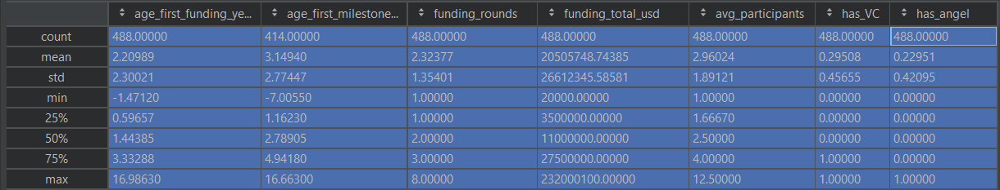

# DATA 310 Final Project - California Startups Success Forecasting Analysis  
### Due Date: 5/18/2021 5:00PM

## Final Presentation Slide [Click Here](https://docs.google.com/presentation/d/1sZCz2qkfwxofQ5vASabRpsx0R50TtfQO2pVes0UZJL4/edit?usp=sharing)
## Final Presentation Link [Click Here] (https://github.com/cning0506/DATA-310_Applied_Machine_Learning/blob/c1524cd2d6a704e738d24ddd19872c06cb070e2b/Final_Presentation.mp4) 


## Abstract 
With the more advanced knowledge on Machine learning techniques, there is a boundless amount of applications with the help of Tensorflow Package, a mainstream Machine Learning Package for Python users. With the ability to predict and evaluate the values based on the training and testing sets, we want to explore the landscape of Startups and investigate the key factors that a Startup needs to succeed in the state of California, which is one of the major birthplaces of US Startups.     

## Data Description
With the dataset that I collected from [Kaggle](https://www.kaggle.com/manishkc06/startup-success-prediction), we are looking at the in-depth profile of 923 startups in the United States. To narrow the scope of the investigation, we will only be analyzing 488 startups in California, which is accounted for more than half (53%) of the dataset. We will create a subset that includes startups that are founded in California. There are 49 features/columns in this data, with a combination of both discrete and continuous data, we will only be focusing on several quantiative features and a few categorical features as well. Figure 1 displays a list of the chosen variables and their descriptive statistics of the California Startups. 

**Figure 1: Descriptive Statistics for the CA Startups**


*Since the duration of the first milestone has a significant amount of missing values and it does not define the variable "milestone", I will not include "milestone" for the following analysis.  

Before we discussed about the descriptive statistics, it is essential to define some of the variables. To start off, we can define how a round financing works. These funding rounds usually refer to the second stage of financing, which is after seed capital (from friends, family, and founders) and the first major round of funding from VCs. These investors offer money in exchange for an equity stake (such as stocks and shares of the Startup). Startups use the money received for talent acquisition and research & development. These funding rounds are usually not profitable but can certain generate revenues and assets for the company. Another variable that we need to understand is Angel investor. These Angels are high net-worth individuals who provide investment in the early difficult stages. The last variable that I would like to acknowledge is the average participants. This is the average size of the employees in a Startup.        

Based on Figure 1, we have observed some interesting characteristics. The first thing we can imply is that most Startups do not have a VC nor Angel as the funding source (With the mean of 0.30 and 0.23), this also stimulate a follow-up question, what would be the long-term funding source of these Startups? We can also tell that the average participants of a Startup is around 3 people. Since it is a quantitative variable, we will consider the average participants of a Startup as a variable in the analysis. In terms of the age of the first funding, we can tell that the average time is two years. Related to the the first funding, we also discover that the average total funding is 20.5 million. 


## Problem Statement 
Google, Facebook, Apple, Amazon, Netflix, all these Big-Tech companies that we know today have been through the stage of Startup. Startup describes the young, rising companies that have started from Zero to One. The First Pot of Gold from a Venture Capitalist and any investor is usually the priority of a Startup. To operate a Startup successfully, apart from the stability of the funding, the duration of surviving in the business environment is another indicator for the investor. When a Startup is able to run for more than an extensive time frame, either the company has found an Angel that has faith in the potential of the company or they have established a trust-worthy reputation in the venture capitalists' world. Regardless of the outcome of a Startup, one of the safest approaches for a Startup to create its legacy is to get acquired by other big-brand companies. Hence, due to the nature of the dataset, the measure of a successful startup is the status of whether getting acquired. The goal of this project is to setup a supervised model that the investor's can use to predict the success of a Startup. We aim to investigate the average time for a Startup to first gain the trust from investors?  What are some commonalities related to the funding among these successfully acquired Startups? 

## Model Specification/Architecture

With all the descriptive statistics in mind, we will establish a supervised model that can predict the necessary conditions of these variables. I decided to change the "status" column to binary variable. Before we use Keras function as the skeleton structure, we will first create another subset for the Startups that are successfully acquired, which gives us 332 samples.

```
# Change the status of acquired and closed to qualitative variable
startup['status'] = startup.status.map({'acquired':1, 'closed':0})
startup['status'].astype(int)

#Create a subset for all success Startup
startup_all = startup
success = startup_all['status']==1
startup_success = startup_all[success]
```
After subsetting the data, we adjust the input shape of the Keras model with the three predictors. We compile the three layers as we proceed to the meat of the model, which is fitting the model and predict the dependent variable, the total funding of a successful startup.  

From the two figures shown in the presentation, we can tell from the results fo the epoch that the loss value is minimize to around 45 Million, which sounds like a huge difference, but we also have to consider the fact that we are using a 10 Million Dollar Scale. We can tell that the total funding of a Startup can varies in a wide range. We have another scatter plot that illustrates the difference between the prediction value and the actual total funding. Based on the fitted line, most of the predictions are not too far from the total fundings. 

## Model Performance Assessment 
We also use the logistic regression to test the model performance. For this model assessment, we first focus on the train-test split. After the train-test split process, we can deploy the logistic regression. In our model, we can explore two features - the histogram of the predicted probabilities and the AUC_ROC Curve.   


## Literature Review 
- **Publication 1: Using Machine Learning to Demystify Startups Funding, Post-Money Valuation, and Success. (Ang et al, 2020)** 

The first paper is published by Harvard Kennedy School as a work of Faculty Research Working Paper Series. It is written by Yu Qian Ang from MIT, Andrew Chia and Soroush Saghafian from Harvard University. The publication aims to predict post-money valuation of startups across various regions and sectors, as well as the probabilities of success. For the analysis, the authors utilize latent Dirichlet allocation, which is a statistical model in natural language processing, with XGBoost, which is a gradient boosting regressor that we have encountered in previous projects. In addition, they also utlize Bayesian optimization. They also utilize TensorFlow to create a neural network model. As a result, they have achieved an accuracy of 95% on the test sets. The goal of this paper is to provide an empirical insight to startups, venture capitalists, and policymakers to set a benchmark for the prediction of success and valuation. 

One thing they discovered is that regions such as San Francisco Bay Area experience high valuations across most sectors. This is an aspect that I would l like to explore if I have more time and data. I want to do an in-depth analysis on the relationship between Startups and different sector. 

In comparison with my model, the accuracy of my model is relatively low. Hence, I would like to enhance my model by either include more observations in the dataset or simply make some adjustment on my model architecture. As an ideal outcome, I would like to create a model that could predict the probabilities of success based on the predictors that I have include in my model. 

- **Publication 2: Predict Startup Success using Network Analysis and Machine Learning Techniques (Huang, G., 2016)** 

The Second paper is published by Stanford University. The name of the author is Bo Guang Huang. The goal of this study is to use neural network analysis techniques on the investment networks, and develop an algorithmic model that can predict if a startup will be successful. The definition of Success in this study is Acquired, IPO, or valued at $1B or more. This is compatible to my definition of success, which makes it a valuable piece of work that I can learn from. 

The author utilizes three attributes for his model, 1) Status assessment base on Centrality calculations, 2) Investor Status attributes that may contribute to the success of a startup, and 3) 
predictors that have Power Law distribution, such as amount of funding and location. In this model, the ratio of train-test split is 90:10. The author also uses three categories of supervised learning methods, including Kernel SVM, Adaptive Boosting, and Random Forest. The result of this analysis is that the Random Forest generally performs well with accuracy around 70%. 

To improve my model, I would like to integrate methods such as random forest and Kernel SVM. If I have more time, I want to setup the workflow for random forest method and try to learn the Kernel SVM. Subsequently, I can make a comparison for all three methodologies, along with the logistic regression.  

## Conclusion
In conclusion, my preliminary results did not reach my expectation and goal of this project. However, I acknowledge the academic and business interest of this research topic. Hence, if I am going to expand on this project, I would definitely try to find more literature that provides different insights and use them as the foundation of my study. Regarding the improvement on model architecture, since I built my model based on the code from previous projects, I would like to re-consider and perhaps customize the model specification more based on my data. 

## Reference
Ang, Y. Q., Chia, A., &amp; Saghafian, S. (2020). Using Machine Learning to Demystify Startups Funding, Post-Money Valuation, and Success. Harvard Kennedy School Faculty Research Working Paper Series. https://doi.org/10.2139/ssrn.3681682 

Ganti, A. 2020. Angel investor. Retrieved April 30, 2021, from https://www.investopedia.com/terms/a/angelinvestor.asp <br/>

Huang, G. B. (2016). Predict Startup Success using Network Analysis and Machine Learning Techniques . Stanford CS224W: Social and Information Network Analysis (Autumn 2016). http://snap.stanford.edu/class/cs224w-2016/projects.html. 

KC, M. (2020, September 16). Startup Success Prediction. Kaggle. https://www.kaggle.com/manishkc06/startup-success-prediction. 

Kenton, W. 2021. What is a round financing? Retrieved April 30, 2021, from https://www.investopedia.com/terms/a/a-round-private-equity.asp
