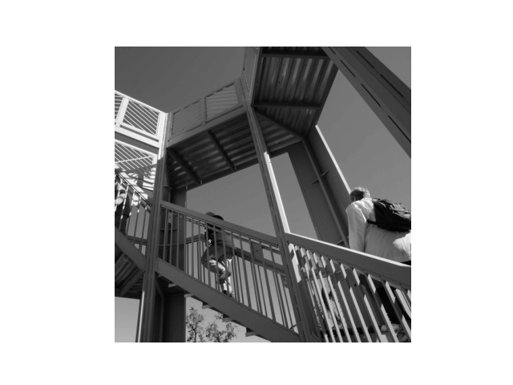

## Informal Response 3 (Feb.19.2021)

### The Original Picture 


### New filters 
```
filter = [ [0,1,0], [1,-4, 1], [0,1,0]]
```
This is the image after applying the first filter.


The filter seems to emphasize more on the horizontal lines compared with the original image. 

```
filter = [[-1, -2, -1], [0, 0, 0], [1, 2, 1]]
```

This the image after applying the second filter. 


The filter seems to emphasize more on the vertical lines compared with the original image. 

```
filter = [[4,2,1],[2,0,-1],[1,2,0]]
```

This the image after applying the third filter. 


The filter creates a high exposure effect, which makes the entire image looks a lot brighter. 

### What are you functionally accomplishing as you apply the filter to your original array?
By applying filters to the original array, we are either increasing or decreasing values to each value of the image array. This effectively changes the color contrast of individual cells. The filter is applied to every 3x3 set of pixels in the image array.

### Why is the application of a convolving filter to an image useful for computer vision? 
A convolving filter to an image can be useful for computer vision when it comes to the detection of object details or characteristics of an image. Similar to the two filters that I applied for the original image, the filters effectively extract the vertical and horizontal diagonal lines. Hence, when we are working on the fashion MNST data set, we could apply the filter concept to identify the type of clothing more accurately.

### Pooling


Pooling has the effect of extracting the key features of the image. Hence, the effect on this staircase image is to highlight the stairs and the people who are walking upstairs, along with their backpacks. It is a combination of horizontal, vertical, and diagonal lines that are crucial to the composition of the image. The size of the image does decrease by filtering the greatest value chosen from the 2x2 pixels, which would reduce the size by 1/4 for the example image. This could optimize the memory usage when we are working with an image with a greater resolution/quality. 

### My Own Image

**A safari image in Black and White**


**My Image in Filter One** 


```
filter = [ [0,1,0], [1,-4, 1], [0,1,0]]
```

### Stretch Goal : **My Image after pooling**


### Convolve the 3x3 filter over the 9x9 matrix and provide the resulting matrix.
```
      [[0, 0, 0, 0, 1, 0, 0, 0, 0],
       [0, 0, 0, 1, 1, 1, 0, 0, 0],
       [0, 0, 0, 1, 1, 1, 0, 0, 0],
       [0, 0, 0, 1, 1, 1, 0, 0, 0],
       [1, 3, 3, 3, 3, 3, 3, 3, 1],
       [0, 0, 0, 1, 1, 1, 0, 0, 0],
       [0, 0, 0, 1, 1, 1, 0, 0, 0],
       [0, 0, 0, 1, 1, 1, 0, 0, 0],
       [0, 0, 0, 0, 1, 0, 0, 0, 0]]
```
