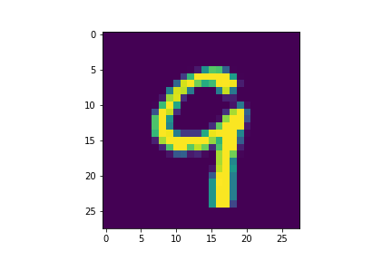
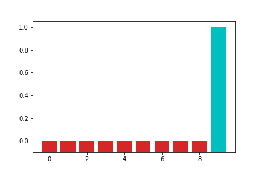

# February 5 Response Version 2.0 - ML Lesson 2 - Computer Vision

### The purpose of splitting training set and testing set
To train the neural network, we need data and labeled images. There are two sets of data, training set and testing set, which are consists of images and labels in each set. The main reason of splitting the data into two is to train the neural network with a unfamiliar assessment. By teaching the neural network with a massive set of training images, we need to test the neural network by providing another new set of testing images that is return with a predicted label. Essentially, we can test the external validity of the training by the accuracy of the prediction. 

### The purpose of Flatten and .Dense (relu and softmax functions) functions
With the original size of 28x28 photos, it is extremely difficult to train 28 layers of 28 neurons of neural network. Using the **Flatten function**, we can reduce the size into 784 x 1. "Dense" function adds a layer of neurons to the network. Within the "Dense" function, there are two activation functions, which are relu and softmax. **Relu** is used to filter the values that equals to 0 or greater to the consequent layer of network. **Softmax** is used to choose the greatest value in a set of values, which effectively optimizes the function. In the final layer, since there are ten categories, there are ten neurons in the final layer. It is presented from the list of number starting from 0 to 9. 

### Optimizer and Loss function parameters
The optimizer is used to adjust the trained model and enhance the performance based on the previous prediction. The loss function of a neural network is used to the accuracy of the prediction in the neural network. Given the dataset we are working on has ten categories, we utilize the categorical loss function because all of the images are being sorted into different types of clothing.

### The shape of the training set
It is consists of 60,000 images, the size of each image is 28 x 28 pixels. 

### The length of the training label 
There are 60,000 labels, one for each image. 

### The shape of the test set 
It is consists of 10,000 images, the size of each image is 28 x 28 pixels as well. 

### Estimation
The result of the prediction was 0.8790000081062317, which has an accuracy of approximately 88%.  

### Plot Exercise 
 

