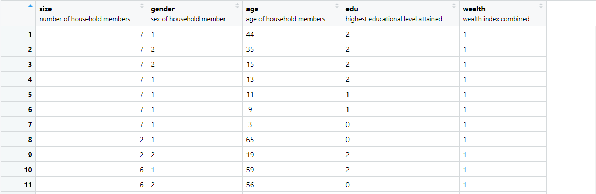

## Import the households dataset for your selected country and create a data frame with chosen variables
We will use the following code snippets to import the household dataset and create a dataframe with the varaibles. 
```
households <- read_dta("PK_DHS_17_18/PKHR71DT/PKHR71FL.DTA")

hhid <- households$hhid #check length(unique(hhid))
unit <- households$hv004
weights <- households$hv005 / 1000000
location <- as_factor(households$shdist)


size <- households$hv009
sex <- households[ ,346:389]
age <- households[ ,390:433]
edu <- households[ ,434:477]

wealth <- households$hv270

hhs <- cbind.data.frame(hhid, unit, weights, location, size, sex, age, edu, wealth)
```
## Pivot the persons columns within your households data to a long format in order to produce a similarly specified dataset that describes all persons residing within all households.




## A Look at Raw, Scaled, Normalized, and Percentized DHS Data

Before we make any transformation on the data, let's take a look at the raw data with a heatmap. As a reminder, these heatmaps do not contain every data, it is a subset of 1,000 samples from the dataset, but they should be representative of the data. In addition, the values are identified as integer for samples, using the codes below. 
```
pns$size <- as.integer(pns$size)
pns$gender <- as.integer(pns$gender)
pns$age <- as.integer(pns$age)
pns$edu <- as.integer(pns$edu)
pns$wealth <- as.integer(pns$wealth)
```
**I will integrate the analysis of these heatmaps in Project 2**

### *Figure 14 : *Raw Data*


### *Figure 15: *Scaled Data*


### *Figure 16: *Normalized Data*


### *Figure 17: *Percentized Data*


