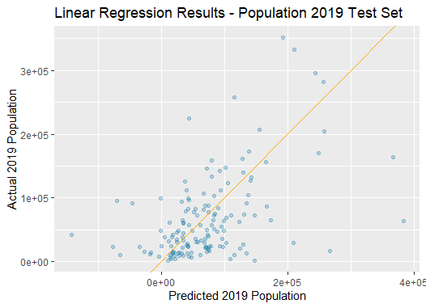
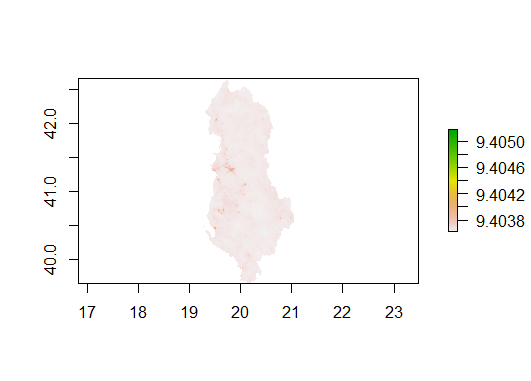

# Informal Response 7 - Intro to Raster Stack (Continued) - Mar.26.2021

#### Disclosure: Due to the size of the raster file, my laptop is not capable of converting Pakistan's data into a Dataframe. Hence, I will be using Albania dataset from now on. 

- Plot 1 - Linear Regression Results

- Plot 2 - Relative Importance of the Variables

- Plot 3 - Density Overview of Albania

