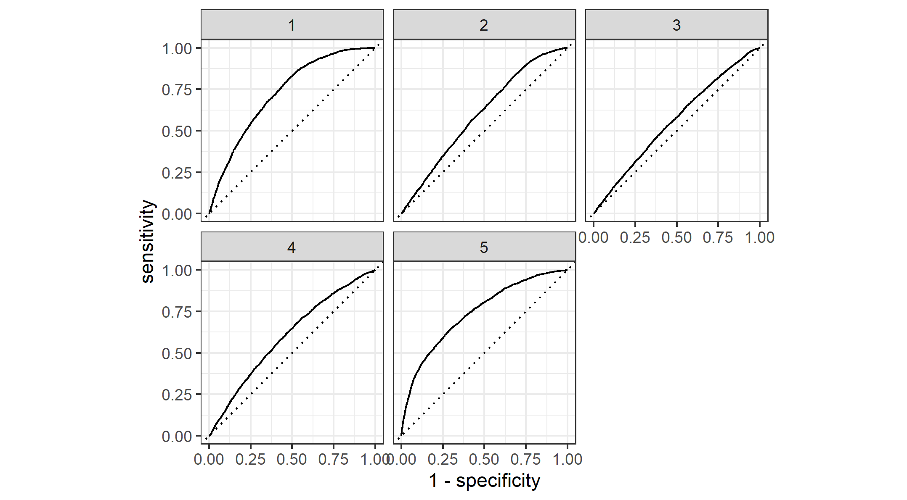

# DATA 310 Applied Machine Learning - Project 2 - DHS Data Analysis 
#### Due Date: 3/24/2021

## Introduction
In this project, we will obtain Pakistan's household statistics requesting from Demographic and Health Surveys (DHS). With the help of two programming langugage, R and Python, we will be training the data, testing the data, and analyzing the data. More specifically, we want to take a look at the Area Under ROC curve and the penalty values by utilizing random forest models, logistic regression models, and gradient boosting models. After generating all four models, we will evaluate which model has the best approach to explain the wealth condition of Pakistan. Moreover, we want to discover which variable might have a more significant impact on the wealth outcomes of Pakistan. As an additional analysis, we will transform the original dataset and visualize them with heatmaps. 

## Data Description
From the DHS website, I chose Pakistan as the country to analyze. The main reason is because of the accessiblity to the latest data. The country has a DHS VII and GPS data that covers the statistics in 2017-2018, which is relatively up to date compared to other countries. In this data, the locations are categorized in districts. 
```
location <- as_factor(households$shdist)
```
After a series of data cleaning, there are 100,819 samples that contains information including number/size, sex, age, and education of household members across 151 districts. To get a glimpse of the descriptive statistics of this dataset, the average household size in Pakistan is around 9. The female and male ratio is 51:49. The average age is 24.2 year-old, which reflects the higher ratio of young population in the nation. The average education that the people in Pakistan attained is primary school.   

## R Script - Model 1 

```
    penalty .metric .estimator  mean     n std_err .config              
      <dbl> <chr>   <chr>      <dbl> <int>   <dbl> <chr>                
 1 0.0001   roc_auc hand_till  0.644     1      NA Preprocessor1_Model01
 2 0.000127 roc_auc hand_till  0.644     1      NA Preprocessor1_Model02
 3 0.000161 roc_auc hand_till  0.644     1      NA Preprocessor1_Model03
 4 0.000204 roc_auc hand_till  0.643     1      NA Preprocessor1_Model04
 5 0.000259 roc_auc hand_till  0.643     1      NA Preprocessor1_Model05
 6 0.000329 roc_auc hand_till  0.643     1      NA Preprocessor1_Model06
 7 0.000418 roc_auc hand_till  0.643     1      NA Preprocessor1_Model07
 8 0.000530 roc_auc hand_till  0.643     1      NA Preprocessor1_Model08
 9 0.000672 roc_auc hand_till  0.643     1      NA Preprocessor1_Model09
10 0.000853 roc_auc hand_till  0.643     1      NA Preprocessor1_Model10
11 0.00108  roc_auc hand_till  0.642     1      NA Preprocessor1_Model11
12 0.00137  roc_auc hand_till  0.642     1      NA Preprocessor1_Model12
13 0.00174  roc_auc hand_till  0.641     1      NA Preprocessor1_Model13
14 0.00221  roc_auc hand_till  0.641     1      NA Preprocessor1_Model14
15 0.00281  roc_auc hand_till  0.640     1      NA Preprocessor1_Model15
16 0.00356  roc_auc hand_till  0.637     1      NA Preprocessor1_Model16
17 0.00452  roc_auc hand_till  0.634     1      NA Preprocessor1_Model17
18 0.00574  roc_auc hand_till  0.628     1      NA Preprocessor1_Model18
19 0.00728  roc_auc hand_till  0.626     1      NA Preprocessor1_Model19
20 0.00924  roc_auc hand_till  0.622     1      NA Preprocessor1_Model20
```

### *Figure 1: Penalty Values versus the Area under the ROC Curve*


#### *Effectiveness of the penalized logistic regression model at predicting each of the five wealth outcomes*


### *Figure 2: Linear Regression AUC Plotting Function*



## R Script - Model 2


## Python - Logistic Regression model

## Python - Gradient Boosting model


## A Look at Raw, Scaled, Normalized, and Percentized Data

### *Figure : *Raw Data*


### *Figure : *Scaled Data*


### *Figure : *Normalized Data*


### *Figure : *Percentized Data*


