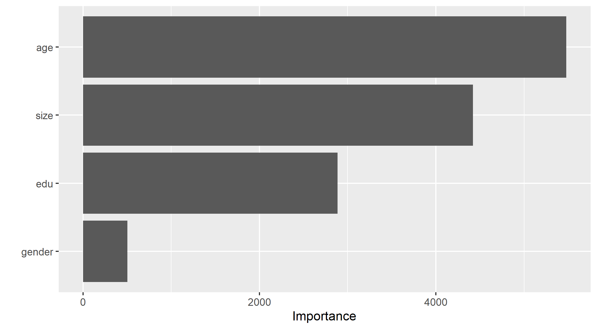
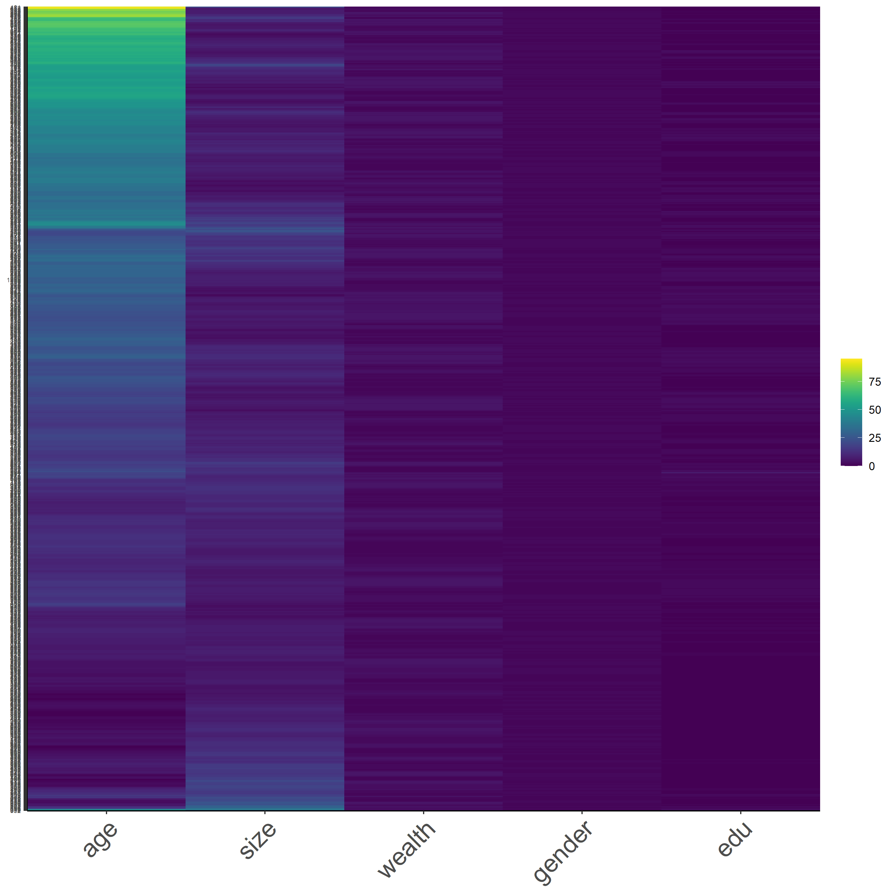

# DATA 310 Applied Machine Learning - Project 2 - Pakistan DHS Data Analysis 
#### Due Date: 3/24/2021

## Introduction
In this project, we will obtain Pakistan's household statistics requesting from Demographic and Health Surveys (DHS). With the help of two programming langugage, R and Python, we will be training the data, testing the data, and analyzing the data. More specifically, we want to take a look at the Area Under ROC curve and the penalty values by utilizing random forest models, logistic regression models, and gradient boosting models. After generating all four models, we will evaluate which model has the best approach to explain the wealth condition of Pakistan. Moreover, we want to discover which variable might have a more significant impact on the wealth outcomes of Pakistan. As an additional analysis, we will transform the original dataset and visualize them with heatmaps. 

## Data Description
From the DHS website, I chose Pakistan as the country to analyze. The main reason is because of the accessiblity to the latest data. The country has a DHS VII and GPS data that covers the statistics in 2017-2018, which is relatively up to date compared to other countries. In this data, the locations are categorized in districts. 
```
location <- as_factor(households$shdist)
```
After a series of data cleaning, there are 100,819 samples that contains information including number/size, sex, age, and education of household members across 151 districts. To get a glimpse of the descriptive statistics of this dataset, the average household size in Pakistan is around 9. The female and male ratio is 51:49. The average age is 24.2 year-old, which reflects the higher ratio of young population in the nation. The average education that the people in Pakistan attained is primary school. The average wealth level of Pakistanian household is 3, which equals to middle class income.    

## R Script - Logistic Regression Model (Model 1) 
With the first R-Script provided in class, we want to split and sample the DHS households data and evaluate the AUC - ROC values. To start off, we aim to answer the first question, **which "top_model" performed the best (had the largest AUC)?**

Below is the output of the Top-Models: 
```
    penalty .metric .estimator  mean     n std_err .config              
      <dbl> <chr>   <chr>      <dbl> <int>   <dbl> <chr>                
 1 0.0001   roc_auc hand_till  0.644     1      NA Preprocessor1_Model01
 2 0.000127 roc_auc hand_till  0.644     1      NA Preprocessor1_Model02
 3 0.000161 roc_auc hand_till  0.644     1      NA Preprocessor1_Model03
 4 0.000204 roc_auc hand_till  0.643     1      NA Preprocessor1_Model04
 5 0.000259 roc_auc hand_till  0.643     1      NA Preprocessor1_Model05
 6 0.000329 roc_auc hand_till  0.643     1      NA Preprocessor1_Model06
 7 0.000418 roc_auc hand_till  0.643     1      NA Preprocessor1_Model07
 8 0.000530 roc_auc hand_till  0.643     1      NA Preprocessor1_Model08
 9 0.000672 roc_auc hand_till  0.643     1      NA Preprocessor1_Model09
10 0.000853 roc_auc hand_till  0.643     1      NA Preprocessor1_Model10
11 0.00108  roc_auc hand_till  0.642     1      NA Preprocessor1_Model11
12 0.00137  roc_auc hand_till  0.642     1      NA Preprocessor1_Model12
13 0.00174  roc_auc hand_till  0.641     1      NA Preprocessor1_Model13
14 0.00221  roc_auc hand_till  0.641     1      NA Preprocessor1_Model14
15 0.00281  roc_auc hand_till  0.640     1      NA Preprocessor1_Model15
16 0.00356  roc_auc hand_till  0.637     1      NA Preprocessor1_Model16
17 0.00452  roc_auc hand_till  0.634     1      NA Preprocessor1_Model17
18 0.00574  roc_auc hand_till  0.628     1      NA Preprocessor1_Model18
19 0.00728  roc_auc hand_till  0.626     1      NA Preprocessor1_Model19
20 0.00924  roc_auc hand_till  0.622     1      NA Preprocessor1_Model20
```

### *Figure 1: Penalty Values versus the Area under the ROC Curve*


I selected Model 12 as the model that performed the best, which has a penalty value of 0.00108. As we can see from Figure 1, the penalty begins to drop significantly slightly after half of the models. Hence, I started the slicing from Model 10, then I testify the best model with the slicing method (shown below) from 5 to 20. After the comparison of 15 models, Model 10,11, and 12 shares similar AUCROC, which demonstrates the largest AUC for all of the outcomes. Hence,  

The Slicing Methdology we use in R
```
lr_best <-
  lr_res %>%
  collect_metrics() %>%
  arrange(penalty) %>%
  slice(11) # Tested Model 5-15
lr_best
```

#### *Effectiveness of the penalized logistic regression model at predicting each of the five wealth outcomes*
With the categorization of level 1 to 5 representing poor to wealthy classes among the population, Figure 2 and 3 displays the effectiveness of two models that predict the five wealth outcomes. As we can see from Figure 2, I used Model 18 as the top model for slicing, which has the penalty value of 0.00574. Out of the five wealth outcomes, category 2 and 3, which are poorer and middle class, tend to have worse performance on the prediction value. Compared to Figure 3, which is based on the performance of Model 12, all five wealth outcomes have btter curves that represent more accurate prediction values. In Figure 3, I used the top performance model, Model 12, for the penalized logistic regression. This Model performs an excellent job in differentiating all five wealth outcomes, except for category 2. Category 1 and 5 both demonstrates great accuracy on prediction.    

### *Figure 2: ROC_AUC plot with Model 18*


### *Figure 3: ROC_AUC Plot with Model 12 (The Top Performing Model)*


## R Script - Random Forest Model (Model 2)
With the second R-Script provided in class, we utilize random forest model and evaluate the AUC - ROC values for the predictors. We will also be looking at the minimal node size based on the wealth outcomes as well. Figure 4 shows the minimal node size with the random predictors. The node size is the parameter that controls the depth of the tree.

### *Figure 4: Minimal Node Size*


**The following two figures are the AUCs for the five wealth outcomes using RF Model and a comparison to the penalized Logistic Regression.**
 
### *Figure 5: ROC_AUC Plot for Random Forest Model*


  

### *Figure 6: Comparison between the Logistic Regression and Random Forest Model*


#### Comparison between Random Forest Model and Penalized Logistic Regression Model 
Based on Figure 5, we can tell that the Random Forest Model shares similar performance with the Logistic Regression Model, especially for the poorer and middle class households (Level 2 and 3). In comparison, the Logistic Regression Model (Figure 3) might be relatively better than the Random Forest model(Figure 5). When we take a closer look at middle and richer wealth outcomes, the AUC values for Random Forest Model are relatively lower than Logistic Regression Model. Overall, I would say the deficit between the two model should not be qualified as a significant indicator of a better model. 

In Figure 6, we have multiple curves with two color schemes, blue and red, each represent Logistic Regression and Random Forest models. There are some overlaps between the two colors, as it demonstrates similar prediction outcomes like we conclude from Figure 5. There is one outlier that could potentially suggest the better prediction power of Logistic regression. We can see that the one of the random forest model seems to overlap the dotted line or the 45 degrees line. This means that it fails to generate random prediction values. Meanwhile, the majority of the curves for RF models lies above logistic regression model. In summary, Figure 6 suggests that RF Model has a sligthly better performance in predictions. 

We have an overview of the predictive power for variables considered in this dataset shown in Figure 7. 
### *Figure 7: Examination of Predictive Power for different variables*


It is clear from Figure 7 that age is the most important predictor for the wealth outcomes for the households in Pakistan, while the size of the households follows the age with some degree of margin. This is beyond my expectation as education is actually the worst predictor out of all. Recalling the summary statistics of the data, the average value of age is 24.2, which might also explain how people with elder age, who usually have more experience and income, could become a crucial factor of the wealth of a household. 

**This is a wrap for the analysis for R. We will apply similar methodology of train-test split data via Python.** 

## Python - Logistic Regression model (Model 3)
With the given Python script, we will train a logistic regression model using the tensorflow estimator API with our DHS data, again with wealth as the target. We will also be applying the linear classifier to the feature columns and determine the accuracy, AUC and other evaluative metrics towards the five wealth outcomes.

- Logistic Regression Evaluation Metrics:

| metric | score |
|----------|-------------|
|accuracy          |        0.808530 |
|accuracy_baseline    |     0.795914 |
|auc       |                0.754338 |
|auc_precision_recall  |   0.448577|
|average_loss      |        0.432013|
|label/mean       |         0.204086|
|loss               |      0.432013|
|precision      |          0.564165|
|prediction/mean      |   0.210902|
|recall            |        0.271773|
|global_step        |     100.000000|


### *Figure 8: ROC for Logistic Regression*


### *Figure 9:  Predicted probabilities Histogram for Logistic Regression*


Figure 7 shows the relationship between True and False positive rate, it has an exponential relationship between the true and false rate. Figure 8 displays the predicted probabilities were mainly clustered at the mid, lower end of the prediction values. This suggests that the model may have focus more on the lower range of values, and under-predicted for mid-higher values. The evaluation metrics show that the model has an AUC value of 0.754, which is acceptable and relatively better than the random models that we have from the R analysis. 

## Python - Gradient Boosting Model (Model 4)
With the last Python script, we will be exploring gradient boosting model using decision trees. We will be taking the same approach of analysis as Model 3. 

| metric | score |
|----------|-------------|
|accuracy          |         0.811268 |
|accuracy_baseline    |     0.795914 |
|auc       |                0.777180 |
|auc_precision_recall  |    0.468442|
|average_loss      |       0.412115|
|label/mean       |         0.204086|
|loss               |      0.412115|
|precision      |           0.596317|
|prediction/mean      |   0.203561|
|recall            |        0.232893|
|global_step        |     100.000000|


### *Figure 10: ROC for Gradient Boosting approach*


### *Figure 11:  Predicted probabilities Histogram for Gradient Boosting approach*


Similarly, this gradient boosting model is also performing better than Model 2 and the ROC curve shares the behavior of Model 3 in a large picture. The main difference between the two models is the last segment of the curve. The slope for Gradient Boosting model reaches zero once it reaches the max of the true positive values unlike Model 3 did not reach 0 until the end of the plot. In addition, the AUC value of model 4 is slightly higher (0.777 compared to 0.754). Though we want the value to be closer to 1, 0.777 is still a fairly good result. Regarding the prediction probabilities histogram, we can tell the mid values have an increasing prediction. However, the major issue is still the higher issues, where it is clearly under-predicted. 

We can compare the overall prediction probabilities for two models, which is shown in Figure 12. 

### *Figure 12: Comparison between the Logistic Regression and Graident Boosting Models with prediction probabilities 


## Conclusion
While all four models have similar plot outputs, we can use AUC values as the standard for the best performing model. Based on the AUC values, the graident boost model has the best performance out of the four, with an AUC value of 0.777. One of the major flaws that the gradient boost model failed to address is the under-prediction of high-values prediction. There are barely predictions above the value of 0.65. Regarding the discrepancies among the five wealth outcomes from my DHS survey dataset, I think the four models do effectively reflect the dataset. As shown from Figure 13, the poorer wealth outcome (2) has the highest frequency, followed by the two outcomes on the opposite side of the spectrum. I think the first two models performed better at predicting the wealth outcomes on both ends, which is the richest and poorest households. Whereas, the third and fourth models seem to do a better job at predicting the middle wealth. However, we must also acknowledge the failure to identify the richest wealth outcome for the two models. From the four models, likewise many developing countries, we can conclude that there is a significant rich and poverty gap in this country. Moreover, with the demographic that consists of younger population as the majority, it is also affecting the wealth outcome of a household in great magnitude. The income inequality might require solutions that incorporate more than education for all. 

### *Figure 13:  Distribution of Wealth level in Pakistan


## A Look at Raw, Scaled, Normalized, and Percentized Data

Before we make any transformation on the data, let's take a look at the raw data with a heatmap. As a reminder, these heatmaps do not contain every data, it is a subset of 1,000 samples from the dataset, but they should be representative of the data. In addition, the values are identified as integer for samples, using the codes below. 
```
pns$size <- as.integer(pns$size)
pns$gender <- as.integer(pns$gender)
pns$age <- as.integer(pns$age)
pns$edu <- as.integer(pns$edu)
pns$wealth <- as.integer(pns$wealth)
```

Figure 13 is a heatmap that presents the raw form of Pakistan DHS dataset. As shown from the figure, we can see that the scale of colors changes more dominantly for the age variable. This is due to the wide range of values for the age variable. Moreover, since the younger population is the majority of the demographics, we can tell that the yellow grids are representing the young-age population. The other variables have its categorical scale, which is going to reduce the variability of the data.   

### *Figure 14 : *Raw Data*



In Figure 15, we have the heatmap that displays our scaled data. This time, we have more variation in each variable while household size variable has a more apparent change of color scale. With the addition of 'scale' function, it subtracts the mean and divide by the standard deviation of the samples. Since household size might have a smaller standard deviation, considering the range of household size and the difference in size is not too large, the household size is going to be shown in more variation. 

### *Figure 15: *Scaled Data*


Next, we have Figure 16, which is a heatmap with normalized data. I think this is the best approach for data transformation, because it is comprehensible and the behavior of each variable can be interpreted easier. First, the gender is divided approximately 50:50 ratio, which aligns with the actual data, which is 49:51 male-female ratio. The wealth is also divided up with the two extreme ends having more bold contrast. Corresponding to the earlier analysis, unlike the poorest and richest outcomes, the middle wealth outcome is hard to identify and differentiate when looking at the overall data. The rest of the varaibles do show some varaitions, but it is less readible unless we analyze the data in smaller segments. 

### *Figure 16: *Normalized Data*


Last but not least, we have Figure 17 that presents the percentized data. This is the second best approach of data transformation since we receive a better variation for all the variables. However, it is relatively harder to interpret compared with the previous heatmap.  

### *Figure 17: *Percentized Data*


