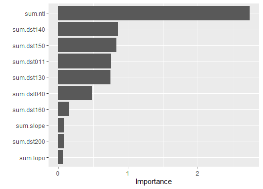
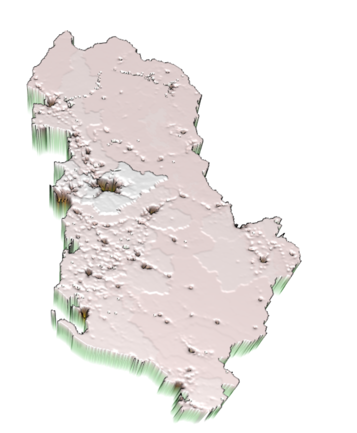

# DATA 310 Applied Machine Learning - Project 3 - Geospatial & Population Prediction Project on Albania 
#### Due Date: 04/16/2021

## Introduction
To predict the population distribution of a country, we need to consider both geographical features (such as slope, water regions) and human activities level (e.g. night time light). In Module 3, we want to integrate the geospaital data with the population data, where the data are stored and loaded in the form of rasters.  In this project, we will aggregate layers of rasters of a country. After generating a data frame, we will begin our analysis with the train-test split method, which gives us a list of predicted values. With two approaches, linear regression and random forest models, we can validate the two models with two model assessment metrics, R2 and MSE values. Last but not least, we will take a closer look at the spatial variation of the country and evaluate.

## Data Description
For this project, since the file size is too large for Pakistan (which was the country that I chose to do for DHS project), I decided to change to **Albania**. We have thirteen raster files and one shape file that we want to aggregate. We have the unconstrained spaital distribution of population raster dataset in 100m resolution from Worldpop, we have the 12 geospatial rasters from Worldpop as well. We have the administrative boundaries shape file from UC Davis' GADM. As a relatively small country, Albania has two levels of administrative boundaries, which is divided into 37 districts. After aggregating the raster files, we have a collection of 7,744,128 data points. This is a relatively small size of dataset compared to Pakistan. Hence, the issue of insufficient sample size would be evaluate towards the end of the anlaysis.  

Before we conduct the two regressions on the data, Figure 1 explains the relative importance of all variables in the dataset. We have "sum.ntl" as the most significant variable for the population. "Ntl" stands for night life light, which also indicates the human activities in different regions of Albania. 

**Figure 1: The Relative Importance of 12 Variables**




## Method 1 - Linear Regression Model
We will first look at the linear regression model. To begin, we apply the train-test split method with the proportion of 4/5. We then utilize these data as the input for the machine learning model. After the setting up the model, we convert the layers of rasters into a data frame and change the variable names with the addition columns of original value (x) and predicted value (y). 

```
rstr_to_df <- as.data.frame(lulc, xy = TRUE)
names(rstr_to_df) <- c("x", "y", "sum.water", "sum.dst011", "sum.dst040", "sum.dst130", "sum.dst140", 
                 "sum.dst150", "sum.dst160", "sum.dst190", "sum.dst200", "sum.topo", 
                 "sum.slope", "sum.ntl", "sum.pop20")
```

## Method 2 - Random Forest 

## Model Validation with R-squared and MSE 

## Model Assessment 




## Spatial Variation Observation
