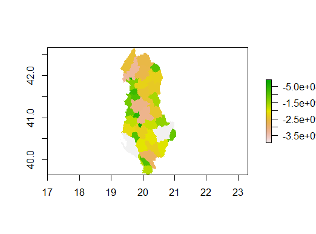
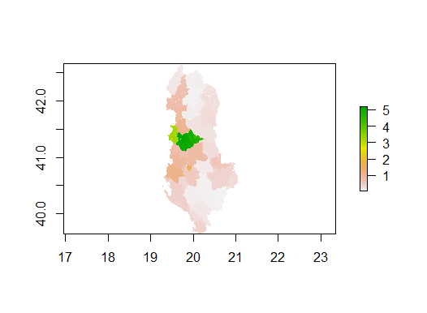
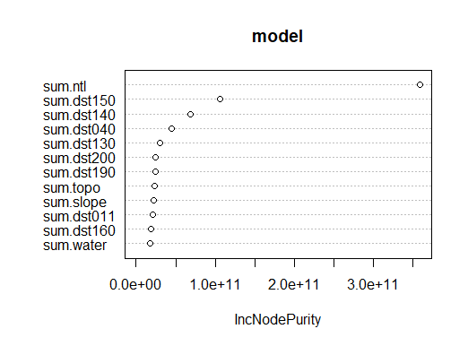
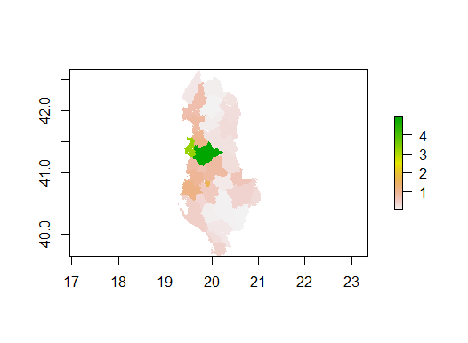

# DATA 310 Applied Machine Learning - Project 3 - Geospatial & Population Prediction Project on Albania 
#### Due Date: 04/18/2021

## Introduction
To predict the population distribution of a country, we need to consider both geographical features (such as slope, water regions) and human activities level (e.g. night time light). In Module 3, we want to integrate the geospaital data with the population data, where the data are stored and loaded in the form of rasters.  In this project, we will aggregate layers of rasters of a country. After generating a data frame, we will begin our analysis with the train-test split method, which gives us a list of predicted values. With two approaches, linear regression and random forest models, we can validate the two models with two model assessment metrics, R2 and MSE values. Last but not least, we will take a closer look at the spatial variation of the country and evaluate.

## Data Description
For this project, since the file size is too large for Pakistan (which was the country that I chose to do for DHS project), I decided to change to **Albania**. We have thirteen raster files and one shape file that we want to aggregate. We have the unconstrained spaital distribution of population raster dataset in 100m x 100m resolution from Worldpop, we have the 12 geospatial rasters from Worldpop as well. We have the administrative boundaries shape file from UC Davis' GADM. As a relatively small country, Albania has two levels of administrative boundaries, which is divided into 37 districts. After aggregating the raster files, we have a collection of 7,744,128 data points. This is a relatively small size of dataset compared to Pakistan. Hence, the issue of insufficient sample size would be evaluate towards the end of the anlaysis.  

Before we conduct the two regressions on the data, Figure 1 explains the relative importance of all variables in the dataset. We have "sum.ntl" as the most significant variable for the population. "Ntl" stands for night life light, which also indicates the human activities in different regions of Albania. 

**Figure 1: The Relative Importance of 12 Variables**


## Method 1 - Linear Regression Model
We will first look at the linear regression model. To begin, we apply the train-test split method with the proportion of 4/5. We then utilize these data as the input for the machine learning model. After the setting up the model, we convert the layers of rasters into a data frame and change the variable names with the addition columns of coordinates x and y.  

```
rstr_to_df <- as.data.frame(lulc, xy = TRUE)
names(rstr_to_df) <- c("x", "y", "sum.water", "sum.dst011", "sum.dst040", "sum.dst130", "sum.dst140", 
                 "sum.dst150", "sum.dst160", "sum.dst190", "sum.dst200", "sum.topo", 
                 "sum.slope", "sum.ntl", "sum.pop20")
```
Once we have all the data ready, we predict the values and plot the sum of the predicted values and import Albania's 2020 Population raster file. 

In Figure 2, we can see the predicted total population sum, which also reflects the regions that have greater population size. As we can tell from the plot, the more populated are concentrated on the west coast, where Albania's capital - Tirane and the Adriatic Sea are located. Whereas the east part of Albania is surrounded by mountain ridges, which has relatively smaller population. There are some regions that are colored in gray, which has the highest populations.    

**Figure 2: Predicted Total Population Sum w/ Linear Regression**



Figure 3 displays the actual total population sum in Albania using linear regression model. 

**Figure 3: Total Population Sum w/ Linear Regression**




Figure 4 shows the difference between the actual population and the predicted population. The green-colored areas means there are no difference between the preidction and the actual population. Hence, for the majority of the map, there is no over-prediction nor under-prediction. However, towards the left side of the map, we can clearly see a small area of the map is colored in yellow/orange. As shown from the scale, we can tell that the area has a deficiency or under-prediction within the range of -60 to -80. We will discuss further regarding the prediction accuracy and the geographical landscapes in the Model assessment section, with the help of the 3D Raster Visualization. 

**Figure 4: Population Difference between WorldPop Data and Predicted values w/ linear regression model**


Before we calculate the model assessment metrics, we want to compare the size of the gridcells between the original dataset and the predicted values. As we can tell from the screenshot below, we have 2,799,761 as the population sum of 2020 compared to the predicted population of 2,798,757. It is evident that the population is under-predicted with the linear regression model. 


## Method 2 - Random Forest 
The second method we are applying is the random forest model. Similar to linear regression, we want to setup the model for random forest, which is based on the population variable from the dataset. We predict the population with the random forest model. To compare the two methods, we also generate the difference in population sum and gridcells. We will also be looking at the 3D Raster visualization in the Model assessment section.  
```
model <- randomForest(sum.pop20 ~ ., data = data)
```

Figure 4 is a plot showing the usefulness of each variable based on inc node purity. We can tell that  there are three variables that are relatively significant, 

**Figure 5: Inc Node Purity of each variable in Random Forest Model**




Based on Figure 5, the random forest model performs better than the linear regression. The distribution of the population is depicted clearly in every region of the map. There are also more variation shown in the plot, which is doing a better job compared to Figure 3. The location of Tirane is easier to identify with the contrast of the population size and the estimation of the geographical location, which is the lightest pink surrounded by the green and orange regions on the center west coast. 

**Figure 6: Predicted Total Population Sum w/ Random Forest**


Figure 7 displays the actual total population sum in Albania using random forest model. 

**Figure 7: Total Population Sum w/ Random Forest**




Figure 8 shows us the popuulation difference using the random forest model. Comparing Figure 4 to Figure 2, it is fair to say they look identical. However, there is still some slight contrast in the color. Figure 4 shows a splash of red in the center of the same area of Figure 2. The red color represents a range that fail between -80 to -100, which indicate the increasing amount of under-prediction for the random forest model. 

**Figure 8: Population Difference between WorldPop Data and Predicted values w/ Random Forest Model**


Lastly, we can take a look at the difference between the size of the gridcells. We have 2,799,761 as the population sum of 2020 compared to the predicted population of 2,519,400. The predicted population is reduced significantly compared to the linear regression model. This supports the argument from Figure 4, where the size of under-prediction grows with the random forest model. 

Based on these two performances, we can assume that the random forest model is a worse model compared to linear regression model. We will verify this assumption with the two metrics, MSE and R-squared. 

## Other Methods - PNS Ranger and Random Forest 

## Model Validation with R-squared and MSE 
After running the two methods, we will validate the two models with the metrics of R-squared, MSE, and MAE. All three of these metrics are conveninent assessment metrics since we have calculated the sum of observed value and the sum of predicted values, which fulfills a part of the calculation for both R-squared and MSE.  In fact, for the Random Forest model, we can get the R-squared value with the "print" function of the model (the code snippet attached below). We get the R-squared value of 0.1127, which means that 11.27% of sample variance is explained by this model. 
```
model <- randomForest(sum.pop20 ~ ., data = data)

print(model)
```
For linear regression, we have to calculate the R-squared with a manual approach. Using the R-squared formula, we get the R-squared value of 0.3576. This means that 35.76% of sample variance is explained by this model. In other words, linear regression model is a better option for explaining the variation of the population.   

Another metrics is mean squared error (MSE). We can use the following code snippets to find MSE. 
```
cellStats((diff_sums)^2, mean)
```
For the linear regression model, the value of MSE is 18.00924. For the random forest, The value of MSE is 18.10797. The linear regression model has a slightly less MSE than the random forest model. Based on this metric, we can tell that the linear regression model is better than the random forest model by a minor margin. It is reasonable to say that both models might not be the ideal methods for this analysis.  

Last but not least, we can compare the 3D Raster Visualizations of MAE with the following package and functions. 
```
install.packages("mapsRinteractive", dependencies = TRUE)
library(mapsRinteractive)
lr_mae <- mae(alb_pop20, population_sums)
rasterVis::plot3D(lr_mae)
```

## Model Assessment and Spatial Variation Observation
To assess the two models, we will be looking at the 3D Raster visaulization from the front and back of Albania. We will first look at the front view of the 3D plot for both model. From the first plot of Figure 6, we can tell that both screenshots seem identical. The main similarity is the apparent hole at the location of Tirane. There are smaller holes that represents the regions that have higher population. We can also observe the river basin across Albania from the lines on the map. In general, the front view does not contribute much for the model assessment, but it provides some insight on the landscape. 

**Figure 6: 3D Raster Visaulization of Linear Regression (a) and Random Forest Models (b) (Front View)** 

(a)


(b)


Looking at the back view of the two plots, we can observe some deviation between the two models. There are a lot of spikes steming from the holes, which can be explained as the under-predictions. As discussed earlier, Tirane has the largest hole, which is reflected as the most dominant spike on the map. Although the screenshots from Figure 7 are taken from different angles, we can see the height of the spikes for the random forest is greater than the linear regression. This suggests the magnitude of the under-prediction is greater for the random forest model. Hence, we can conclude that the linear regression model is a more accurate model for the population prediction of Albania.   

**Figure 7: 3D Raster Visaulization of Linear Regression (a) and Random Forest Models (b) (Back View)** 

(a)


(b)


As the final analysis, we will try to scale the data to subregions and examine the spatial variation of urban and suburban areas. 

## Conclusion 
In conclusion, considering the results of both 3D visualization and metrics, linear regression has shown a more accurate model than the random forest approach. There are several factors to consider. First, Albania is a small nation, which also reflects on the size of the data point. This could affect the effectiveness of the model prediction. As an extension to this factor, the second barrier that I encountered is the insufficient population variation across the regions. Unlike other countries with large land mass, which has a distinction in population density between urban and suburban areas, Albania is harder to examine the variation. To resolve this barrier, we rescale the data and concentrate on the two districts, x and y. Consequently, we can tell the ... model is a better model for predicting the population. If I have more time, I will try another method such as convolutional neural networks.    
